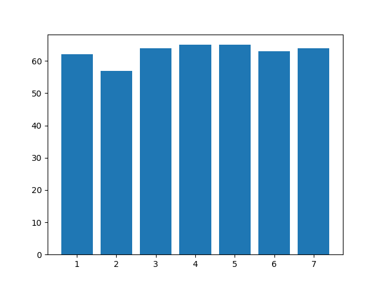
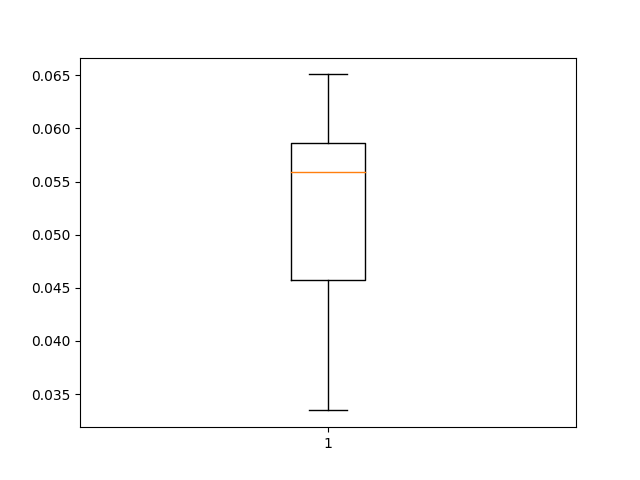
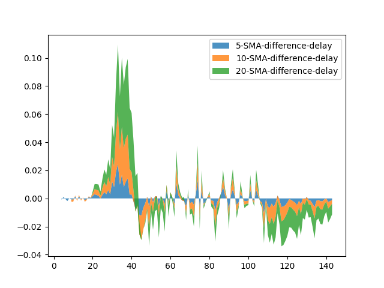
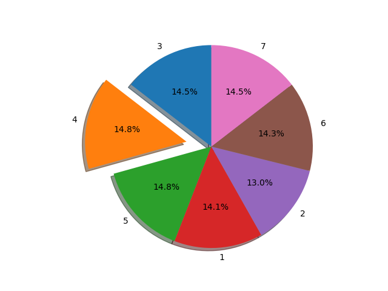

# PEMS-SF

## Project Report

### Setup

To use the project, create a Conda environment with Python version 3.10:

```bash
conda create -n my_env python==3.10
```

Then, activate the environment:

```bash
conda activate my_env
```

### Exploratory Data Analysis (EDA) Task (for both datasets)

#### PEMS-SF Dataset Analysis

##### a) Visualizations

1.  
2.  
3.  
4.  
5.  

##### b) Interpretation

- The data appears to be nearly perfectly balanced, with fewer entries on Tuesdays and slightly more on Thursdays and Fridays.
- A sharp increase followed by a plateau in the range 0.06-0.08, and then a slower decline, is observed in the moving averages.
- The boxplot shows a very high median value, greater than the mean, indicating a strong right skewness.

### Feature Extraction and Classification Task (for PEMS-SF dataset)

#### 1. Best Model

The RandomForest model achieved the highest accuracy of 77% after fine-tuning.

#### 2. Hyperparameters and Their Impact

Hyperparameters did not significantly impact performance, except in the case of RandomForest, where ideal parameter tuning improved accuracy by up to 27%.

#### 3. Impact of Features

The newly added features did not have a significant impact, likely due to the high dimensionality of the data, where a relatively small number of features is not "felt" by the model's representation power.

#### 4. Best Classes

Classes 1 and 7 had the best performance for each model, possibly explained by these days being outliers of the inter-week traffic congestion in a city.

#### 5. Comparison Tables

Comparison metric (accuracy score):

##### RandomForest

| (n_estimators, max_depth, max_samples) | Accuracy |
|-----------------------------------------|----------|
| 50, None, 0.1                          | 0.509    |
| 50, None, 0.5                          | 0.536    |
| 50, 10, 0.1                             | 0.766    |
| 50, 10, 0.5                             | 0.770    |
| 100, None, 0.1                          | 0.534    |
| 100, None, 0.5                          | 0.511    |
| 100, 10, 0.1                            | 0.7      |
| 100, 10, 0.5                            | 0.711    |

##### SVM

| (kernel, C) | Accuracy |
|-------------|----------|
| linear, 0.1 | 0.441    |
| poly, 0.1   | 0.466    |
| linear, 1.0 | 0.445    |
| poly, 1.0   | 0.452    |

##### Xgboost

| (n_estimators, max_depth) | Accuracy |
|----------------------------|----------|
| 50, None                   | 0.791    |
| 50, 10                     | 0.791    |
| 100, None                  | 0.795    |
| 100, 10                    | 0.795    |

### Additional Tasks

#### MLP

| (batch_size, optimizer, epochs) | Accuracy |
|----------------------------------|----------|
| 8, Adam, 5                       |          |
| 8, Adam, 10                      |          |
| 8, SGD, 5                        |          |
| 8, SGD, 10                       |          |
| 16, Adam, 5                      |          |
| 16, Adam, 10                     |          |
| 16, SGD, 5                       |          |
| 16, SGD, 10                      |          |

#### LSTM

| (batch_size, optimizer, epochs) | Accuracy |
|----------------------------------|----------|
| 8, Adam, 5                       |          |
| 8, Adam, 10                      |          |
| 8, SGD, 5                        |          |
| 8, SGD, 10                       |          |
| 16, Adam, 5                      |          |
| 16, Adam, 10                     |          |
| 16, SGD, 5                       |          |
| 16, SGD, 10                      |          |

#### CNN

| (batch_size, optimizer, epochs) | Accuracy |
|----------------------------------|----------|
| 8, Adam, 5                       |          |
| 8, Adam, 10                      |          |
| 8, SGD, 5                        |          |
| 8, SGD, 10                       |          |
| 16, Adam, 5                      |          |
| 16, Adam, 10                     |          |
| 16, SGD, 5                       |          |
| 16, SGD, 10                      |          |

### File Structure

- **boxplotter.py**
- **main.py**
- **preprocess.py**
- **train_nn.py**
- **visualizer.py**


[](https://stand-with-ukraine.pp.ua)
