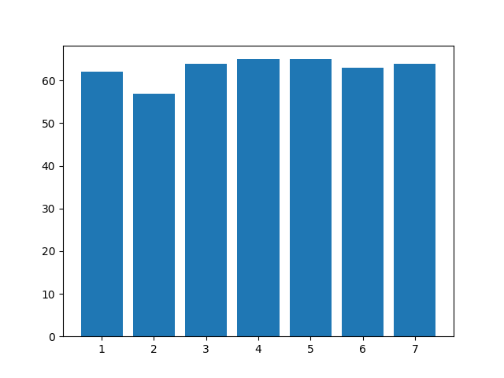
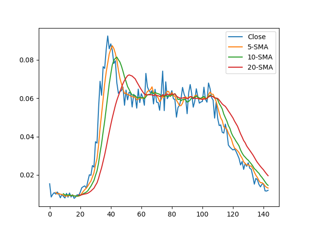
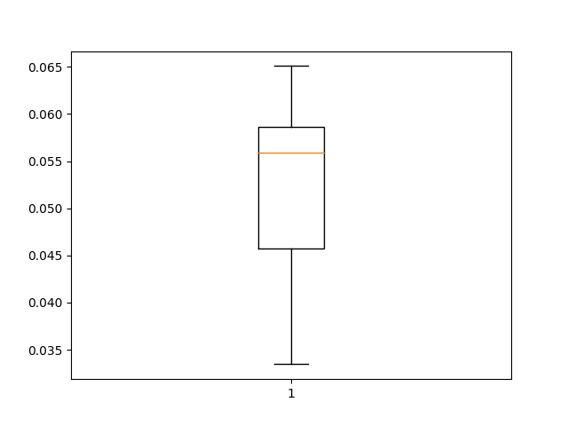
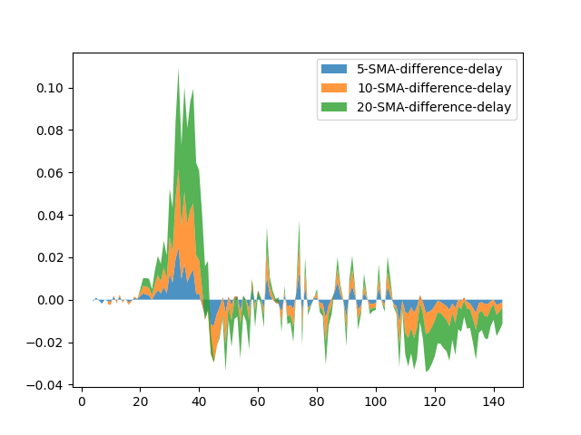
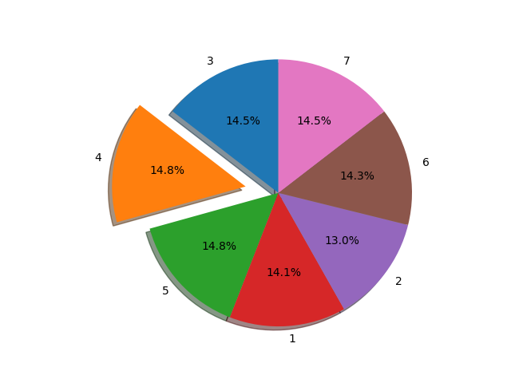

# Raport

## Pregatirea proiectului

Pentru a folosi proiectul este necesara crearea unui environment anaconda cu versiunea python 3.10

```commandline
conda create -n my_env python==3.10
```

Pentru a activa apoi mediul:

```
conda activate my_env
```
## 3.1 Task-ul de analiza exploratorie a datelor (pe ambele seturi de date)

### 1. Analiza setului PEMS-SF

#### a) Grafice 











#### b) Interpretare

Ceea ce figura 1 ne arata este ca datele sunt aproape perfect balansate, se poate observa ca sunt mai putine date in zilele de marti si ceva mai multe in zilele de joi si vineri.

Uitandu-ne la figura 2 se poate observa o crestere brusca, urmata de o stationare in intervalul 0.06-0.08 si apoi o scadere mai lenta, ceea ce se poate vedea si din cum arata cele 3 moving averages realizate pe figura. 

Din analiza figurii numarul 3 se poate vedea ca boxplot-ul surprinde o valoare mediana foarte inalta, mai mare in decat media valorilor, totodata diferenta intre percentila 75 si 50 este mult mai mica decat intre percentila 50 si 25. Deci putem deduce ca boxplotul este skewed puternic spre dreapta

## 3.2 Task-ul de feature extraction si clasificare (pentru setul de date PEMS-SF)

### 1. Cel mai bun model

Cel mai bun model a fost de departe RandomForest ajungand dupa finetuning la o acuratete de 77%.

### 2. Hiperparametrii si impactul lor

Hiperparametrii nu s-au dovedit sa aiba o diferenta foarte mare in performanta, fata de scenariul in care nu s-a facut finetunare hiperparametrilor, exceptand cazul Random Forest cand au fost diferente chiar de 27 de procente cu ajutorul finetunarii unor parametri ideali.

### 3. Impactul featureurilor

Featureu-urile noi adaugate nu au avut impact semnificativ (relevant statistic), fapt dovedit din faptul ca datele au o dimensionalitate foarte mare, iar un numar relativ mic de feature-uri nu este "simtit" de puterea de reprezentare a modelelor.

### 4. Cele mai bune clase

Clasele 1 si 7 au avut cele mai bune rezultate pentru fiecare model in parte, fapt ce e posibil sa se explice prin faptul ca aceste zile pot fi outliere ale saptamanii intermeni de aglomeratie intr-un oras (deoarece oamenii se deplaseaza in/din afara orasului in aceste zile, restul zileleor fiind mai similare si deci mai usor de confudat de catre model).

#### 5. Tabele de rezulate

Metrica de comparare (scorul de acuratete)

##### RandomForest
(n_estimators, max_depth, max_samples)
- 50, None, 0.1: 0.50909091
- 50, None, 0.5: 0.53636364
- 50, 10, 0.1: 0.76590909
- 50, 10, 0.5: [ 0.77045455 ]
- 100, None, 0.1: 0.53409091
- 100, None, 0.5: 0.51136364
- 100, 10, 0.1: 0.7
- 100, 10, 0.5: 0.71136364

##### SVM
(kernel, C)
- linear, 0.1: 0.44090909
- poly, 0.1: [ 0.46590909 ]
- linear, 1.0: 0.44545455
- poly, 1.0: 0.45227273

##### Xgboost

(n_estimators, max_depth)
- 50, None: [ 0.79090909 ]
- 50, 10: 0.79090909,
- 100, None: 0.7954545
- 100, 10: 0.79545

##### 3.3

## 3.3

### MLP

(batch_size, optimizator, epoci)
- 8, Adam, 5: 
- 8, Adam, 10: 
- 8, SGD, 5: 
- 8, SGD, 10: 
- 16, Adam, 5: 
- 16, Adam, 10: 
- 16, SGD, 5:
- 16, SGD, 10:

### LSTM

(batch_size, optimizator, epoci)
- 8, Adam, 5: 
- 8, Adam, 10:
- 8, SGD, 5:
- 8, SGD, 10:
- 16, Adam, 5:
- 16, Adam, 10:
- 16, SGD, 5:
- 16, SGD, 10:

### CNN

(batch_size, optimizator, epoci)
- 8, Adam, 5: 
- 8, Adam, 10:
- 8, SGD, 5:
- 8, SGD, 10:
- 16, Adam, 5:
- 16, Adam, 10:
- 16, SGD, 5:
- 16, SGD, 10:
